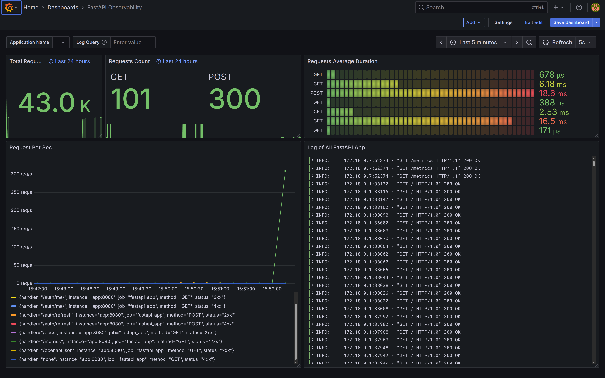
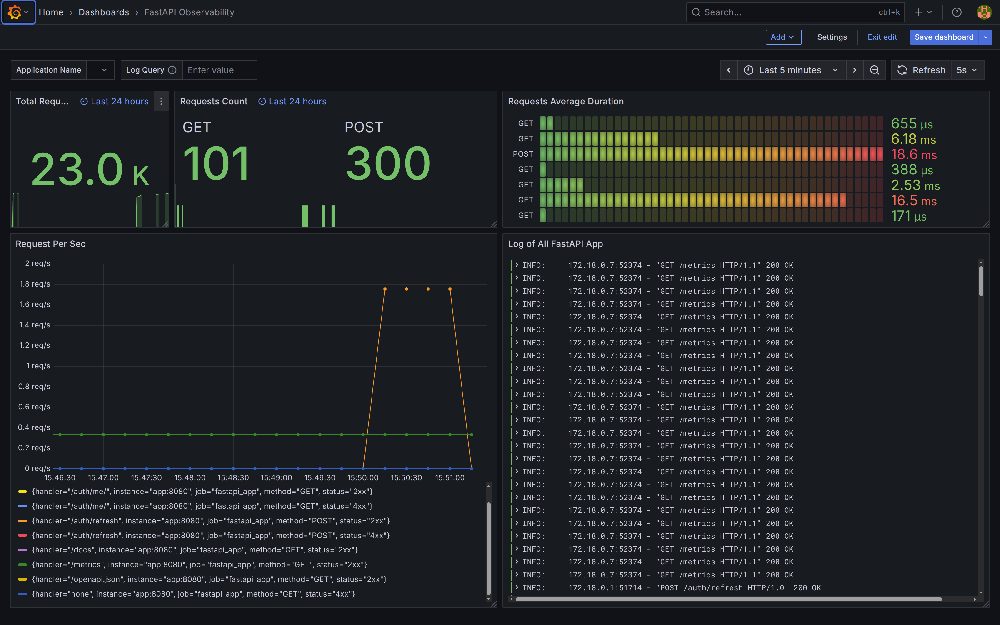

# Grafana Collection of Metrics

This project demonstrates a complete monitoring and log collection system using a modern stack of tools: **Grafana**, **Loki**, **Prometheus**, and **Promtail**.

## Project Goal

The main goal of the project is to show how to integrate and configure an observability system for a FastAPI web application:

- **Grafana** — visualization of metrics and logs through dashboards
- **Prometheus** — collection and storage of application metrics
- **Loki** — aggregation and storage of logs
- **Promtail** — agent for collecting logs and sending them to Loki

The project includes a ready-made FastAPI application with an authentication system that generates metrics and logs to demonstrate monitoring capabilities.

## What the Monitoring System Includes

### Grafana Dashboard
- Visualization of application performance metrics
- Monitoring of HTTP requests, response time, errors
- Real-time log display
- Configured alerts and notifications

### Prometheus Metrics
- Collection of FastAPI application metrics
- Monitoring of system resources (CPU, memory, disk)
- Database and external service metrics
- Custom business metrics

### Loki Logs Aggregation
- Centralized storage of application logs
- Structured logs with labels
- Fast log search and filtering
- Integration with Grafana for metrics and logs correlation

### Promtail Log Collection
- Automatic log collection from containers
- Log parsing and enrichment with labels
- Real-time log sending to Loki






## Project Architecture

```
├── app/                          # FastAPI application
│   ├── auth/                     # Authentication module
│   ├── dao/                      # Data Access Objects
│   ├── migration/                # Database migrations
│   ├── static/                   # Static files
│   ├── config.py                 # Application configuration
│   ├── main.py                   # FastAPI entry point
│   └── exceptions.py             # Exception handling
├── grafana/                      # Grafana configuration
├── ab/                          # Load testing results
├── prometheus.yml               # Prometheus configuration
├── loki-config.yml             # Loki configuration
├── promtail-config.yaml        # Promtail configuration
├── docker-compose.yml          # Main Docker configuration
├── docker-compose.staging.yml  # Staging environment
├── docker-compose.prod.yml     # Production environment
└── docker-compose.test.yml     # Test environment
```

## Quick Start

### 1. Clone the Repository
```bash
git clone https://github.com/gooodh/grafana_collection_of_metrics.git
cd grafana_collection_of_metrics
```

### 2. Start the Monitoring System
```bash
docker compose up --build -d
```

### 3. Access Services

After startup, the following services will be available:

- **FastAPI Application**: http://localhost:8000
- **Grafana**: http://localhost:3000 (admin/admin)
- **Prometheus**: http://localhost:9090
- **Loki**: http://localhost:3100

### 4. Generate Test Data

To demonstrate the monitoring system, you can generate load:

```bash
# Install Apache Bench (if not installed)
sudo apt-get install apache2-utils

# Generate HTTP requests
ab -n 1000 -c 10 http://localhost:8000/
```

## Monitoring Configuration

### Health Check Endpoints

Приложение предоставляет расширенные health check endpoints с интеграцией Prometheus:

- `GET /health` - базовая проверка состояния
- `GET /health/detailed` - детальная проверка с БД и системными ресурсами  
- `GET /health/ready` - readiness probe для Kubernetes
- `GET /health/live` - liveness probe для Kubernetes
- `GET /health/metrics` - метрики здоровья в JSON формате
- `GET /metrics` - Prometheus метрики

```bash
# Тестирование health endpoints
make health-check

# Просмотр метрик здоровья
make health-metrics
```

### Prometheus Метрики

Приложение автоматически экспортирует следующие метрики:

**Стандартные FastAPI метрики:**
- `http_requests_total` - общее количество HTTP запросов
- `http_request_duration_seconds` - время выполнения запросов
- `http_requests_inprogress` - запросы в процессе выполнения

**Кастомные метрики здоровья:**
- `database_connection_status` - статус подключения к БД
- `database_response_time_seconds` - время отклика БД
- `system_cpu_percent` - использование CPU
- `system_memory_percent` - использование памяти
- `system_disk_percent` - использование диска
- `health_check_requests_total` - количество health check запросов
- `fast_requests_total` - количество быстрых запросов (< 100ms)
- `slow_requests_total` - количество медленных запросов (> 1s)

### Prometheus
Configuration in `prometheus.yml` file:
- Collect metrics from FastAPI application every 15 seconds
- Monitor Prometheus itself
- Configure alerting rules

### Loki
Configuration in `loki-config.yml` file:
- Store logs in local filesystem
- Configure indexes for fast search
- Log retention settings

### Promtail
Configuration in `promtail-config.yaml` file:
- Collect logs from Docker containers
- Parse JSON logs
- Add labels for filtering

### Grafana
- Pre-installed dashboards for FastAPI monitoring
- Data sources: Prometheus and Loki
- Configured alerts and notifications

## Useful Commands

```bash
# View service logs
docker compose logs -f grafana
docker compose logs -f prometheus
docker compose logs -f loki
docker compose logs -f promtail

# Restart individual service
docker compose restart grafana

# Stop all services
docker compose down

# Clean up data (careful!)
docker compose down -v
```

## Monitoring in Different Environments

The project supports different configurations for various environments:

- **Development**: `docker-compose.yml`
- **Testing**: `docker-compose.test.yml`
- **Staging**: `docker-compose.staging.yml`
- **Production**: `docker-compose.prod.yml`

```bash
# Run in staging environment
docker compose -f docker-compose.staging.yml up -d

# Run in production environment
docker compose -f docker-compose.prod.yml up -d
```
